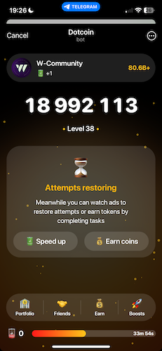

README

Getting Started
---------------




### Contact
If you have any questions or need assistance, please:
Contact me on Telegram: https://t.me/ennyolajide
Or email me at: eniseyinolajide@gmail.com


### Follow me on Twitter
Stay up-to-date with my latest updates and projects:
[@EnnyJd](https://twitter.com/EnnyJd)


### Setup

1. Rename the file `example.env` to `.env` by running the command:

   ```mv example.env .env```
   Alternatively, you can rename the file manually.

2. Update TELEGRAM_USER_ID, BEARER_TOKEN and API_TOKEN in the .env file

3. Install the required Node modules by running the command:

   ```npm install ```
   
4. Start the application by running the command:

   ```node index.js```

That's it! You should now be up and running.

5. Run the ```node index.js``` every 17 minutes or create a cron job that will execute every 17 minutes

Happy Mining

Note: Make sure you have Node.js installed on your system.